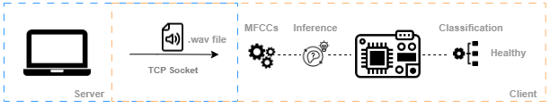
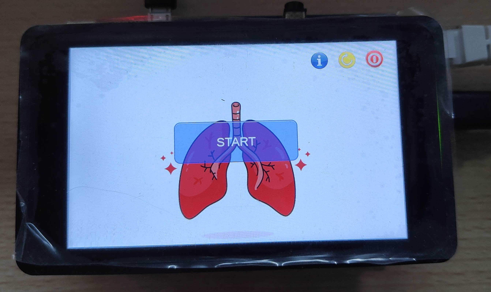
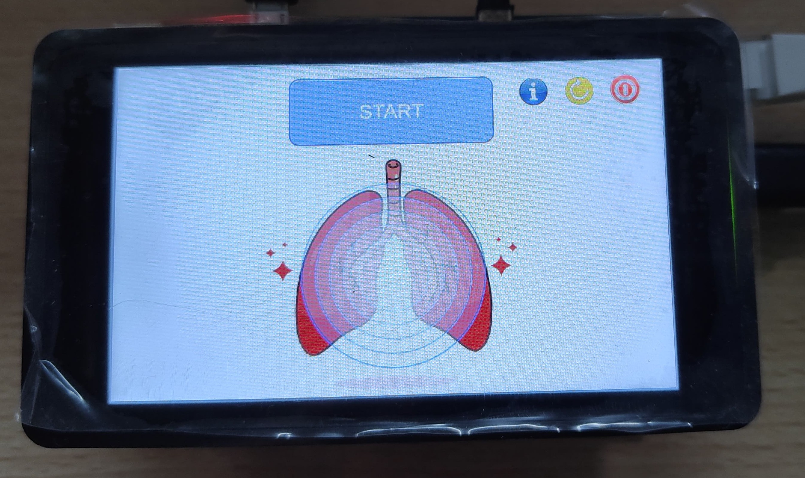
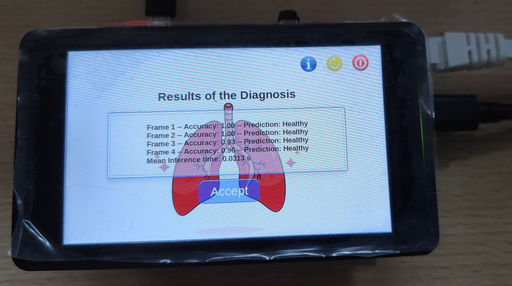

# TFM

Embedded neural network for lungs diagnosis in STM32MP1 devices..

It includes:

- The code of the GUI.
- The code to evaluate the performance of the model through a tcp socket.

Warnings:

- Must have flashed on the device a compatible version of OpenSTLinux distribution with the X-Linux-AI framework.
- Wrapper code of the NeuralNetwork class to link with the stai_mpu static library.

## Results

This section describes the architecture to evalute and simulate a real scenario. Since a stethoscope is not available to capture sound from the lung scans, it will be necessary to provide the audio from a PC to the device through the network.

 

Here an example is provided in order to show the application works:

  
  

  

